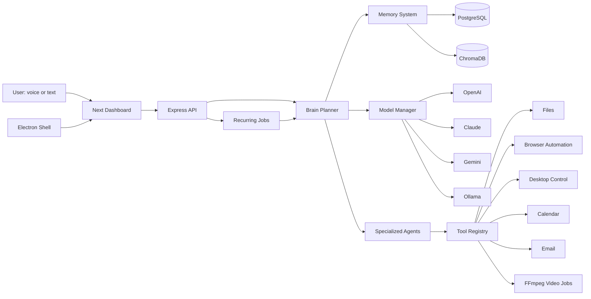

# JARVIS AI OS

JARVIS is a local-first personal AI operating system assistant. It is built as a modular monorepo so the brain, memory, tools, agents, dashboard, and desktop shell can evolve independently.

## What Is Included

- Next.js, React, TypeScript, TailwindCSS, and Framer Motion dashboard
- Electron desktop wrapper
- Express TypeScript API
- Brain module with planning, tool selection, specialist agent routing, memory injection, and approval gating
- Short-term, long-term, and semantic memory
- PostgreSQL, Redis, and ChromaDB services
- Multi-model routing across OpenAI, Claude, Gemini, and Ollama fallback
- Tool registry with MCP-style manifest
- File, browser, search, terminal, calendar, email, desktop, and video tools
- Scheduler for recurring assistant jobs
- Voice engine hooks for wake-word transcript handling and interruptible TTS events
- Security layer with encrypted memory, audit logs, JWT auth, and high-risk approval requirements

## Run Locally

1. Install dependencies:

```bash
npm install
```

2. Create your environment:

```bash
cp .env.example .env
```

3. Start infrastructure:

```bash
docker compose up postgres redis chroma
```

4. Start API and dashboard:

```bash
npm run dev
```

5. Open the dashboard:

```text
http://localhost:3000
```

The API runs at `http://localhost:4010/api`.

## Desktop App

Start the web app first, then run:

```bash
npm run dev:desktop
```

## Production Compose

```bash
docker compose up --build
```

## Architecture



## Safety Model

Low-risk actions can execute directly. High-risk and critical actions, such as desktop control, file writes, terminal commands, media processing, and destructive operations, are converted into pending tool calls that require explicit approval before execution.

## Module Map

- `apps/api/src/brain`: planning, reasoning orchestration, agent selection
- `apps/api/src/agents`: productivity, research, coding, content, video, personal assistant, computer control agents
- `apps/api/src/memory`: short-term, encrypted long-term, semantic Chroma memory
- `apps/api/src/models`: multi-provider model routing
- `apps/api/src/tools`: discoverable tool registry and implementations
- `apps/api/src/security`: permission classification and encryption
- `apps/api/src/scheduler`: recurring background jobs
- `apps/api/src/voice`: wake-word transcript pipeline and TTS events
- `apps/web`: operational dashboard
- `apps/desktop`: Electron wrapper
- `packages/contracts`: shared Zod schemas and TypeScript contracts

## Current Integration Notes

Email and calendar tools are implemented as provider-ready boundaries. They return connection status until OAuth credentials and provider scopes are added. Desktop and terminal tools are real but approval-gated. The video tool validates FFmpeg availability and prepares media jobs; full clip scoring can be expanded behind `video.prepare_reels`.
